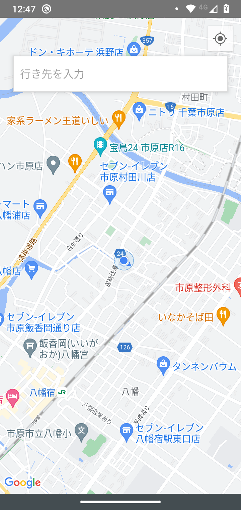
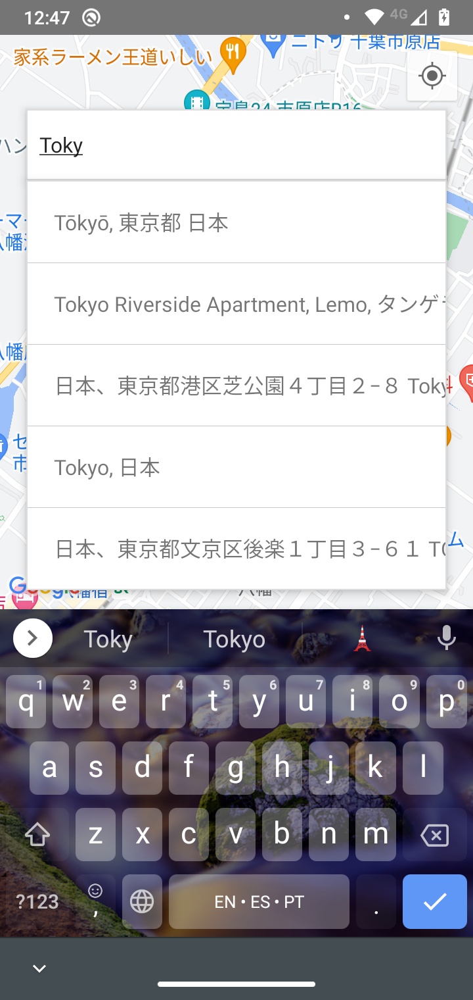
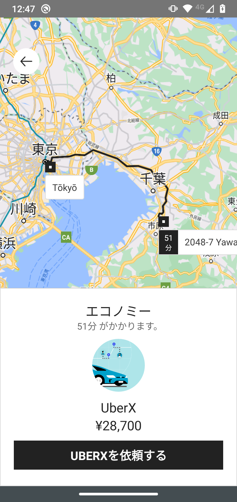

<h1>
  Uber Clone
</h1>

<b>* THIS IS NOT COMPLETE, ONLY ONE SCREEN!</b>

## Libs

> react-native-geocoding

> react-native-geolocation-service

> react-native-google-places-autocomplete

> react-native-maps-directions

> react-native-maps

## Preview

  
  
  

 

 Made with 💛 by Thiago da Paz

